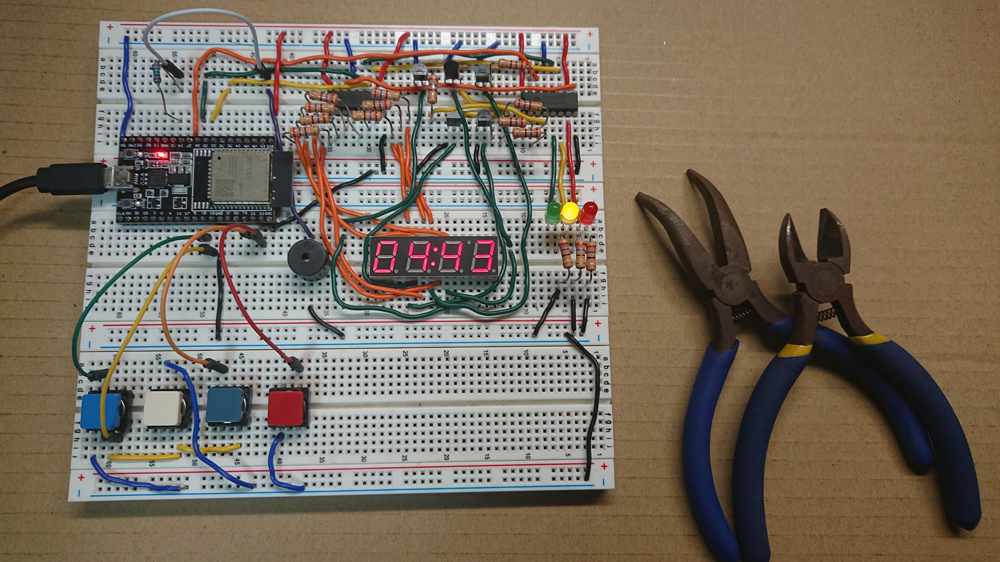

\begin{table}[ht!]
    \centering
    \large
    \begin{tabular}{p{2cm}|p{13cm}} \hline
        装置名          & four buttons      \\\hline
        装置番号        & 000-001           \\\hline
        作問者          & Write your name   \\\hline
        作問日          & 2021 9/28         \\\hline
        制限時間        & 15m00s            \\\hline
    \end{tabular}
\end{table}

# 作問者より一言
この装置は練習問題となる基礎的な問題です．
ボタン4つから構成されているシンプルな作りになってます．  
落ち着いて配線とプログラムの関係が理解できれば解けることでしょう．


# 回路
回路の全体の写真を[@fig:circuit]に示す．

{#fig:circuit}

また，回路に使用する部品の一覧を[@tbl:parts]に示す．

部品名          個数        データシート
------          ------      ------------
タクトスイッチ  4           [https://akizukidenshi.com/download/ds/switronic/1273HIM-160G-G.pdf](https://akizukidenshi.com/download/ds/switronic/1273HIM-160G-G.pdf)

: 回路に使用する部品の一覧 {#tbl:parts}

# ソースコード
[@lst:code]に競技に使用するソースコードを示す．
```{.cpp #lst:code caption="競技に使用するソースコード" title="timer.ino"}
// giver pin assgin
const uint8_t NAVY_BUTTON  = 22;
const uint8_t WHITE_BUTTON = 18;
const uint8_t RED_BUTTON   = 19;
const uint8_t BLUE_BUTTON  = 23;

int time_limit = 300;

void gaming(void *pvParameters) {
	bool flag1 = false;
	bool flag2 = false;
	bool flag3 = false;
	bool flag4 = false;
	while(1) {
		delay(1);
		flag1 = (digitalRead(NAVY_BUTTON)  == LOW);
		flag2 = (digitalRead(WHITE_BUTTON) == HIGH);
		flag3 = (digitalRead(BLUE_BUTTON)  == LOW);
		flag4 = (digitalRead(RED_BUTTON)   == HIGH);
		
		// succeeded
		if(flag1 && flag2 && flag3) {
			signal     = GREEN;
			timer_stop = true;
			while(1) delay(1e5);
		}

		// failed
		if(!flag4) {
			signal = RED;
			timer_stop = true;
			digitalWrite(BUZZER, HIGH);
			while(1) delay(1e5);
		}
	}
}
```


